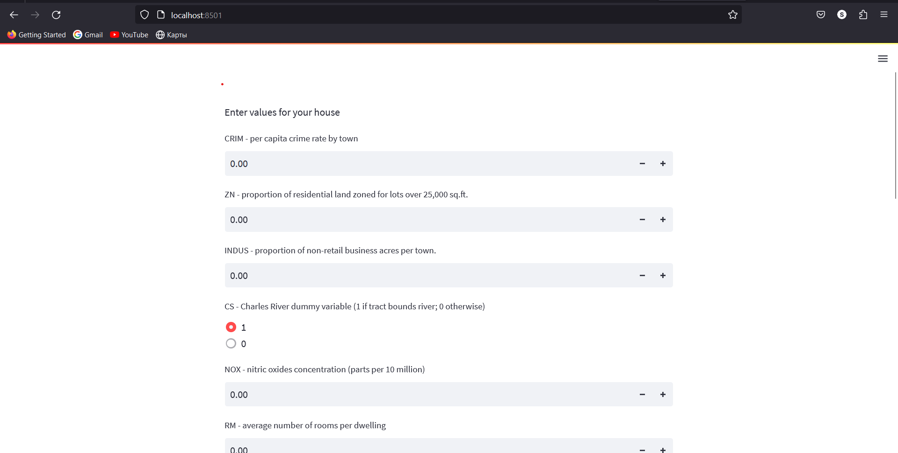
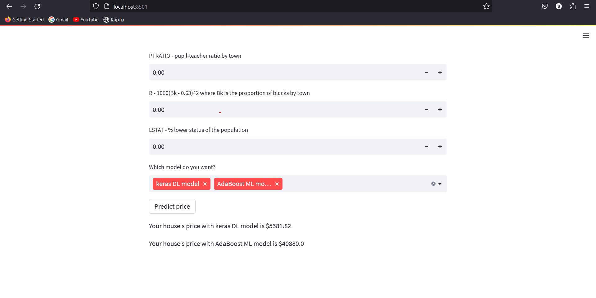
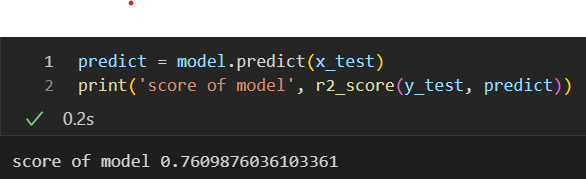
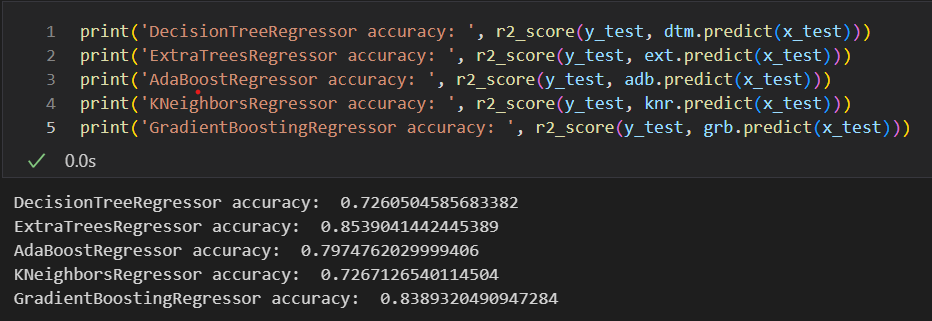

# Boston Housing dataset

This dataset contains information collected by the U.S Census Service concerning housing in the area of Boston Mass. It was obtained from the StatLib [archive](http://lib.stat.cmu.edu/datasets/boston), and has been used extensively throughout the literature to benchmark algorithms. However, these comparisons were primarily done outside of Delve and are thus somewhat suspect. The dataset is small in size with only 506 cases.

Columns of the dataset

CRIM - per capita crime rate by town<br>
ZN - proportion of residential land zoned for lots over 25,000 sq.ft.<br>
INDUS - proportion of non-retail business acres per town.<br>
CS - Charles River dummy variable (1 if tract bounds river; 0 otherwise)<br>
NOX - nitric oxides concentration (parts per 10 million)<br>
RM - average number of rooms per dwelling<br>
AGE - proportion of owner-occupied units built prior to 1940<br>
DIS - weighted distances to five Boston employment centres<br>
RAD - index of accessibility to radial highways<br>
TAX - full-value property-tax rate per $10,000<br>
PTRATIO - pupil-teacher ratio by town<br>
B - 1000(Bk - 0.63)^2 where Bk is the proportion of blacks by town<br>
LSTAT - % lower status of the population<br>

### Usage of [Streamlit](https://github.com/streamlit/streamlit.git)

```
streamlit run stream.py
```

The result is as follows:

<a></a>

You can choose the model you want to predict the price of your house

<a></a>

## Features

### Deep Learning

- we have deep neural network with keras in [tensorflow](https://github.com/tensorflow/tensorflow.git)<br>
  Accuracy of the model:

<a></a>

### Machine Learning

- we trained the dataset with popular ML algorithms:

1. DecisionTreeRegressor
2. ExtraTreesRegressor
3. GradientBoostRegressor
4. AdaBoostRegressor
5. KNeighborsRegressor

Accuracies of this models on the dataset:

<a></a>

## Installation

Install python and:

```
pip install -r requirements.txt
```
